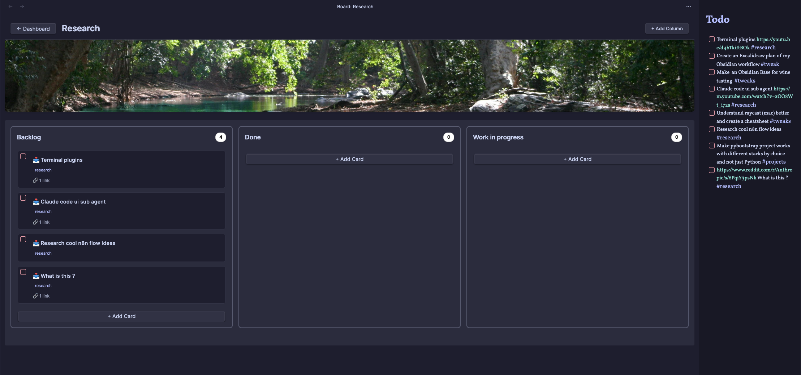

# ✨ Crystal Boards

<div align="center">


**AI-Powered Kanban Plugin for Obsidian**

*Transform any content into actionable tasks with the power of AI*

[](https://github.com/qgoossens-craft/crystal-boards)
[](https://obsidian.md)
[](LICENSE)


[ Features](#-features) • [ Installation](#-installation) • [ AI Magic](#-ai-powered-smart-extract) • [ Usage](#-usage) • [ Configuration](#-configuration)

</div>

---



## What is the Crystal Boards plugin ?

I've built Crystal Boards to better fit my personal needs in Obsidian. I wasn't satisfied with the existing Kanban solutions (too focused on assignees,deadlines, importance tags,..) to be useful for me outside a work environment.

I wanted a simple Kanban where I could triage my ideas and Brain Dump notes from my Obsidian.

During it's development, I thought "Why not putting some AI in it ?"

That's exactly what I did and it came out beautifully to be a research assistant with a Kanban on-top.

I envisioned a tool that would not only help me organize my tasks but also enhance my creative process through intelligent suggestions and automation.

I wanted to be able to dump my ideas and my research topics in my todo and have the AI help me organize and prioritize them right into my Kanban.

## Currently we have 3 ways of using Crystal Boards :

**1 - Using it as a simple Kanban**: You can perfectly use it as a simple Kanban to triage your ideas and todos.

**2 - Using the native Extract feature**: By clicking on "Extract", Crystal Boards will automatically scan the associated note for tagged todos and triage them into the right Kanban Boards.

**3 - Using the AI-powered Smart Extract feature** : This allows you to extract tasks from various sources like YouTube videos, Reddit posts, and web content seamlessly and triage the todos into your 

---


---


Crystal Boards isn't just another Kanban plugin - it's your **AI-powered productivity companion** that transforms any content into actionable workflows:

-  **AI-Powered Smart Extract**: Convert YouTube videos, Reddit posts, and web content into organized tasks
-  **Intelligent Task Processing**: GPT-powered analysis and enhancement
-  **Beautiful Visual Interface**: Stunning dashboard with drag & drop functionality  
-  **Responsive Design**: Perfect on desktop and mobile
-  **Deep Obsidian Integration**: Seamless note linking and vault integration


##  Features

###  **AI-Powered Smart Features**
- **YouTube Transcript Analysis** - Extract actionable tasks from video content
- **Reddit Content Intelligence** - Smart extraction from Reddit posts and discussions  
- **URL Content Processing** - Automatic metadata and task generation from web content
- **TodoAI Enhancement** - GPT-powered task processing and intelligent suggestions
- **Smart Categorization** - Automatic hashtag-based 


###  **Advanced Task Management**
- **Task Source Sync** - Auto-sync with external task files and monitoring
- **Hashtag Organization** - Smart filtering and categorization system
- **Deep Note Integration** - Rich linking with preview and navigation
- **Bulk Operations** - Select all cards in columns, mass editing
- **Real-time Updates** - File watching and automatic board synchronization

### **Beautiful Interface**
- **Visual Dashboard** - Stunning grid layout with cover images
- **Custom Themes** - Adapts to your Obsidian theme automatically
- **Responsive Design** - Perfect experience on any device
- **Smooth Animations** - Polished interactions and feedback
- **Intuitive UX** - Drag & drop everything, visual feedback

### **Power User Features**
- **Column Reordering** - Move columns with arrow buttons
- **Bulk Selection** - Select all cards in a column with one click
- **Smart Loading** - Beautiful progress indicators for AI operations
- **⌨Keyboard Shortcuts** - Efficient navigation and actions
- **Advanced Settings** - Fine-tune every aspect of your workflow


## Installation

### Method 1: Community Plugins (Coming Soon)
1. Open Obsidian Settings
2. Go to Community Plugins → Browse
3. Search for "Crystal Boards"
4. Install and enable

### Method 2: Manual Installation
1. Download the latest release from [GitHub](https://github.com/qgoossens-craft/crystal-boards/releases)
2. Extract to your vault's `.obsidian/plugins/crystal-boards/` folder
3. Restart Obsidian and enable the plugin

### Method 3: BRAT (Beta Testing)
1. Install the [BRAT plugin](https://github.com/TfTHacker/obsidian42-brat) from Community Plugins
2. Open BRAT settings in Obsidian
3. Click "Add Beta plugin" and enter: `qgoossens-craft/crystal-boards`
4. BRAT will automatically download and install the latest beta release
5. Enable Crystal Boards in Settings → Community Plugins

**Note**: BRAT installations automatically update to new beta releases when available.

## AI-Powered Smart Extract

The crown jewel of Crystal Boards - transform any content into organized tasks with AI magic:

### YouTube Video Processing
```
- Paste any YouTube URL
- AI extracts transcript and key points  
- Generates actionable tasks automatically
- Smart categorization with hashtags
```

### Reddit Content Intelligence
```
🔗 Paste Reddit post or comment URL
📖 Extracts post content and discussions
💡 Identifies actionable items and insights
📊 Organizes into structured tasks
```

### Web Content Analysis
```
🌍 Any web URL or article
📄 Intelligent content extraction
🎯 Identifies tasks and action items
✨ Clean, organized task cards
```

### AI Configuration
Support for multiple AI models:
- **GPT-4o** (Recommended) - Fast & intelligent
- **GPT-4o Mini** - Fast, affordable  
- **GPT-4 Turbo** - High intelligence
- **GPT-4** - Classic high-intelligence
- **GPT-3.5 Turbo** - Legacy, cost-effective

## Usage

### Quick Start

1. **Open Dashboard**: Click the Crystal Boards icon in the ribbon
2. **Create Board**: Click "Create Board" and name your project
3. **Smart Extract**: Use the AI-powered extraction for instant task creation
4. **Organize**: Drag & drop cards between columns
5. **Link Notes**: Connect cards to your existing Obsidian notes

### Dashboard Magic

<table>
<tr>
<td width="50%">

**🖼️ Visual Organization**
- Beautiful grid layout
- Custom cover images
- Quick board access
- Responsive design

</td>
<td width="50%">

**⚡ Quick Actions**
- Create boards instantly
- Bulk operations
- Board reordering
- Smart search (coming soon)

</td>
</tr>
</table>

### 📋 Board Management

#### 🎨 **Column Customization**
- **➕ Add Columns**: Custom workflow stages
- **🎨 Color Coding**: Visual organization
- **↔️ Reordering**: Arrow button navigation
- **⚙️ Smart Configuration**: Intelligent defaults

#### 🃏 **Advanced Card Features**
- **🤖 AI Enhancement**: Smart content suggestions
- **🔗 Note Linking**: Deep Obsidian integration
- **🏷️ Tag Management**: Hashtag organization
- **📎 Rich Content**: URLs, previews, metadata

#### ⚡ **Power Features**
- **☑️ Bulk Selection**: Select all cards in column
- **🔄 Real-time Sync**: Auto-update from external sources
- **📱 Mobile Optimized**: Touch-friendly interface
- **⌨️ Keyboard Navigation**: Efficient workflows

## ⚙️ Configuration

### 🤖 AI Settings

```javascript
// OpenAI Configuration
{
  "openAIApiKey": "sk-your-api-key",
  "openAIModel": "gpt-4o-mini", // Fast & affordable
  "maxTokens": 2000,
  "temperature": 0.3
}
```

### 📁 File Management

```javascript
// Board Storage
{
  "kanbanFolderPath": "Kanban", // Custom folder location
  "taskSourcePath": "Tasks.md", // External task file sync
  "showCoverImages": true,
  "boardsPerRow": 3
}
```

### 🎨 Visual Customization

```css
/* Custom Board Styling */
.crystal-board-card {
    background: linear-gradient(135deg, #667eea 0%, #764ba2 100%);
    border-radius: 12px;
    box-shadow: 0 8px 32px rgba(0,0,0,0.1);
}

/* Modern Card Design */
.crystal-card {
    backdrop-filter: blur(10px);
    border-left: 4px solid var(--interactive-accent);
    transition: all 0.3s ease;
}
```

## 🛠️ Advanced Features

### 📊 Task Source Integration

Connect Crystal Boards to external task files for powerful automation:

```markdown
# Your Tasks.md file
- [ ] #project Review quarterly reports
- [ ] #meeting Prepare presentation slides  
- [ ] #coding Fix authentication bug #priority-high
```

Crystal Boards automatically:
- 📥 Imports tasks with hashtags
- 🔄 Syncs changes in real-time  
- 🎯 Organizes by categories
- ⚡ Updates boards automatically

### 🌐 URL Enhancement

Paste any URL and watch the magic:

```
🔗 Input: https://example.com/article
📊 Output: 
  - Rich preview with title/description
  - Automatic metadata extraction
  - Smart task generation
  - Category suggestions
```

### 🎯 Smart Loading & Feedback

Beautiful progress indicators show AI processing:
- 🤖 Smart Extract Processing
- 📊 Progress tracking (0-100%)
- ❌ Cancel anytime
- ✅ Success animations

## 🗂️ Project Structure

```
your-vault/
├── 📁 Kanban/                 # Main boards folder (customizable)
│   ├── 📁 Work Project/       # Individual board folders  
│   │   ├── 🖼️ cover.jpg      # Custom cover images
│   │   └── 📄 notes/          # Linked notes
│   ├── 📁 Personal/           # Personal task boards
│   └── 📁 Learning/           # Learning & development
└── 📁 .obsidian/
    └── 📁 plugins/
        └── 📁 crystal-boards/ # Plugin files
            └── 📄 data.json   # Board data storage
```

## 🎨 Customization Gallery

### 🌈 Theme Variations

<table>
<tr>
<td width="33%">

**🌙 Dark Theme**
- Elegant dark interface
- Neon accent colors  
- Modern glassmorphism

</td>
<td width="33%">

**☀️ Light Theme**  
- Clean, bright design
- Subtle shadows
- Professional appearance

</td>
<td width="33%">

**🎨 Custom Themes**
- Your brand colors
- Custom CSS styling
- Unlimited possibilities

</td>
</tr>
</table>

## 🔧 Development & Contributing

### 🚀 Development Setup

```bash
# Clone the repository
git clone https://github.com/qgoossens-craft/crystal-boards.git

# Install dependencies  
cd crystal-boards
npm install

# Start development mode
npm run dev

# Build for production
npm run build
```

### 📝 Project Architecture

```typescript
// Core Components
CrystalBoardsPlugin      // Main plugin class
├── DataManager          // Data persistence & management
├── DashboardView        // Visual board grid interface  
├── BoardView            // Individual board interface
├── SmartExtractService  // AI-powered content processing
├── TodoAIService        // Intelligent task enhancement
├── TaskExtractionService // File sync & monitoring
└── SettingsTab          // Configuration interface
```

### 🤝 Contributing

We welcome contributions! Please:

1. 🍴 Fork the repository
2. 🌿 Create feature branch: `git checkout -b feature/amazing-feature`
3. ✅ Test thoroughly with TypeScript: `npm run build`
4. 📝 Commit changes: `git commit -m 'Add amazing feature'`
5. 🚀 Push branch: `git push origin feature/amazing-feature`
6. 🔄 Open Pull Request

## 📋 Roadmap

### 🎯 Version 2.0 (Coming Soon)
- [ ] 📅 **Calendar Integration** - Date-based task management
- [ ] 🔍 **Advanced Search** - Full-text search across all boards
- [ ] 📋 **Templates System** - Reusable board and card templates  
- [ ] ⏰ **Time Tracking** - Built-in productivity analytics
- [ ] 🔄 **Automation Rules** - Custom workflow automation

### 🚀 Version 3.0 (Future)
- [ ] 👥 **Team Collaboration** - Multi-user support
- [ ] 🌐 **Cloud Sync** - Cross-device synchronization
- [ ] 📊 **Analytics Dashboard** - Productivity insights
- [ ] 🔌 **API Integration** - Connect external services
- [ ] 🎨 **Advanced Theming** - Visual customization toolkit

## 🐛 Troubleshooting

### 🔧 Common Solutions

<details>
<summary><strong>🤖 AI Features Not Working</strong></summary>

- ✅ Verify OpenAI API key in settings
- 🔄 Check internet connection
- 💰 Ensure API credits are available
- 🔑 Validate API key format (starts with `sk-`)

</details>

<details>
<summary><strong>📱 Plugin Not Loading</strong></summary>

- 📁 Check plugin folder location: `.obsidian/plugins/crystal-boards/`
- 📄 Ensure all files present: `main.js`, `manifest.json`, `styles.css`
- 🔄 Restart Obsidian completely
- ⚙️ Enable in Settings → Community Plugins

</details>

<details>
<summary><strong>🖱️ Drag & Drop Issues</strong></summary>

- 🎯 Ensure dragging card elements (not other UI parts)
- 🔄 Refresh board view if needed
- 🕵️ Check browser console for JavaScript errors
- 📱 Try on different device/browser

</details>

### 🆘 Getting Help

- 📋 Check [Issues](https://github.com/qgoossens-craft/crystal-boards/issues) page
- 🐛 Create detailed bug report with:
  - 💻 Obsidian version & OS
  - 📝 Steps to reproduce  
  - 🖼️ Screenshots if helpful
- 💬 Join our [Discord Community](#) (coming soon)

## 📄 License

This project is licensed under the **MIT License** - see the [LICENSE](LICENSE) file for details.

## 🙏 Acknowledgments

- 🙌 **Obsidian Team** - For the incredible plugin API and platform
- 🤝 **Community Contributors** - Bug reports, feature requests, and testing
- 🧠 **OpenAI** - Powering the AI features that make this plugin special
- 🎨 **Design Inspiration** - Modern productivity apps and design systems

## 💖 Support the Project

If Crystal Boards helps boost your productivity:

- ⭐ **Star the repository** - Show your appreciation
- 🐛 **Report bugs & request features** - Help make it better
- 🤝 **Contribute code** - Join the development
- ☕ **Buy me a coffee** - [Support development](https://buymeacoffee.com/qgoossens)
- 📢 **Share with others** - Spread the word!

---

<div align="center">

**✨ Made with ❤️ for the Obsidian Community ✨**

*Transform your productivity with AI-powered task management*

[](https://github.com/qgoossens-craft)
[](#)
[](#)

</div>